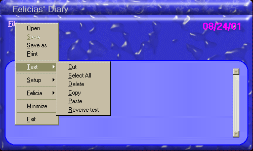



## Diary

### Description

This App. shows you how to use skinz in your applications,

Open files for Append, Save and Load Data, Do Logging,

Give forms a custom shape, Apply security to your applications,

Allow forms to stay at top most, Drag a form without a titlebar, Read, Write, and Delete entries to an *.ini file, Have error handling in your app and much, much more. Great for a beginner to intermediate programmer. Please leave comments and/or suggestions.
 
### More Info
 
How to start a new Stanard exe project.

None!

             |
---                |---
**Submitted On**   |2001-08-24 19:23:56
**By**             |[TwinB](https://github.com/Planet-Source-Code/PSCIndex/blob/master/ByAuthor/twinb.md)
**Level**          |Intermediate
**User Rating**    |4.4 (35 globes from 8 users)
**Compatibility**  |VB 4\.0 \(16\-bit\), VB 4\.0 \(32\-bit\), VB 5\.0, VB 6\.0
**Category**       |[Complete Applications](https://github.com/Planet-Source-Code/PSCIndex/blob/master/ByCategory/complete-applications__1-27.md)
**World**          |[Visual Basic](https://github.com/Planet-Source-Code/PSCIndex/blob/master/ByWorld/visual-basic.md)
**Archive File**   |[Diary252958242001\.zip](https://github.com/Planet-Source-Code/twinb-diary__1-26622/archive/master.zip)

